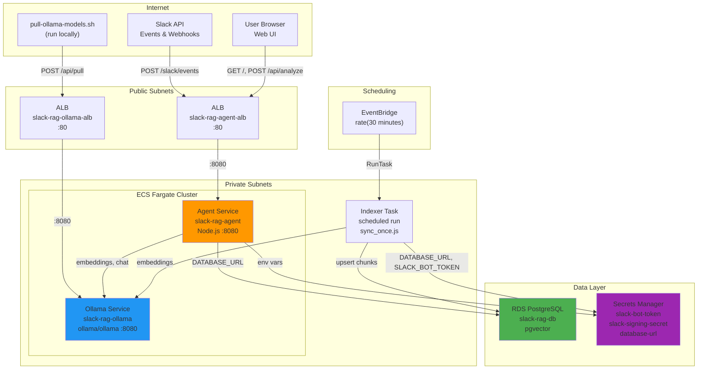
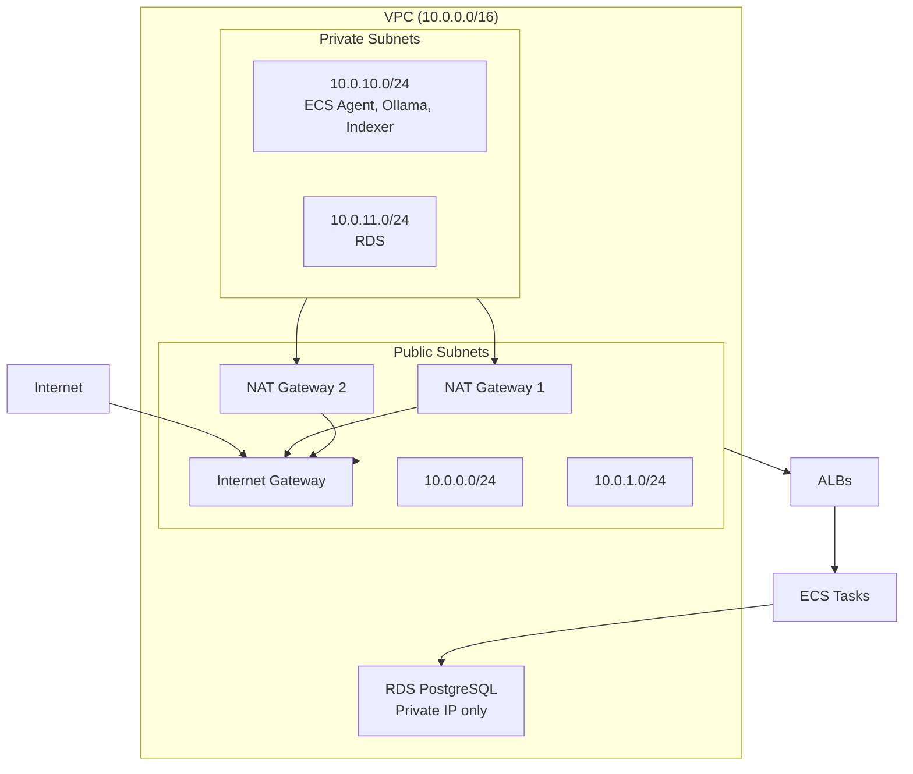

# Slack RAG Bot — AWS Architecture

## Infrastructure Overview

The Slack RAG Bot runs on AWS using ECS Fargate, RDS PostgreSQL, Secrets Manager, and EventBridge. This document describes the infrastructure layout, data flows, and design decisions.

---

## System Architecture Diagram



---

## Network Architecture



---

## Component Details

### Entry Points

| Component | Purpose |
|-----------|---------|
| **slack-rag-agent-alb** | Receives Slack events (`/slack/events`), Web UI traffic (`/`, `/api/analyze`) |
| **slack-rag-ollama-alb** | Receives model pull requests (`/api/pull`) and inference (`/api/embeddings`, `/api/chat`, `/api/generate`) |

### ECS Services

| Service | Image | CPU | Memory | Port |
|---------|-------|-----|--------|------|
| **slack-rag-agent** | ECR: slack-rag-bot | 512 | 2048 MB | 8080 |
| **slack-rag-ollama** | Docker Hub: ollama/ollama | 4096 | 8192 MB | 8080 |

### Scheduled Task

| Task | Schedule | Command |
|------|----------|---------|
| **slack-rag-indexer** | EventBridge: rate(30 minutes) | `node src/indexer/sync_once.js` |

### Data Store

| Resource | Engine | Purpose |
|----------|--------|---------|
| **slack-rag-db** | RDS PostgreSQL 15 | Stores indexed Slack chunks with pgvector embeddings |

### Secrets

| Secret | Used By |
|--------|---------|
| slack-rag/slack-bot-token | Agent, Indexer |
| slack-rag/slack-signing-secret | Agent |
| slack-rag/database-url | Agent, Indexer |

---

## Request Flows

### 1. Slack Event (e.g., message in channel)

```
Slack → ALB (:80) → Agent (:8080)
       → Verify signing secret
       → Process message (parse, retrieve RAG, decide, format)
       → Agent → Ollama (embeddings for retrieve, chat for answer)
       → Agent → RDS (search similar chunks)
       → Agent → Slack (post reply)
```

### 2. Web UI Query

```
User → ALB (:80) → Agent (:8080)
     → POST /api/analyze { text }
     → Retrieve contexts (Agent → Ollama embeddings, Agent → RDS)
     → Build RAG prompt, Ollama chat
     → Return JSON response
```

### 3. Indexer (scheduled)

```
EventBridge (every 30 min) → ECS RunTask (indexer)
→ Fetch Slack channels, messages, threads
→ Ollama embeddings per chunk
→ RDS upsert chunks
```

### 4. Model Pull (one-time / after deploy)

```
User runs pull-ollama-models.sh
→ curl Ollama ALB /api/pull
→ Ollama downloads tinyllama, nomic-embed-text
```

---

## Security

- **VPC isolation**: ECS tasks and RDS run in private subnets; no direct internet access.
- **Secrets**: Injected at task startup from Secrets Manager; never in code or logs.
- **RDS**: Not publicly accessible; only ECS tasks in the same VPC can connect.
- **IAM**: Task execution role for ECR/Secrets; task role for app-level permissions.

---

## Terraform Layout

```
infra/aws/
├── main.tf          # Provider, locals (ollama_url, agent_image)
├── variables.tf     # region, db_instance_class, ollama_cpu, etc.
├── outputs.tf       # agent_url, ollama_url, ecr_repository_url
├── vpc.tf           # VPC, subnets, NAT, route tables
├── rds.tf           # RDS instance, subnet group, security group
├── secrets.tf       # Secrets Manager (Slack, database URL)
├── ecr.tf           # ECR repository for slack-rag-bot
├── ecs.tf           # Cluster, IAM, security groups
├── alb.tf           # Agent ALB, target group, listener
├── ollama.tf        # Ollama ALB, target group, listener
├── ecs_agent.tf     # Agent task def, service
├── ecs_ollama.tf    # Ollama task def, service
├── ecs_indexer.tf   # Indexer task def
└── eventbridge.tf   # Schedule rule, ECS target
```

---

## GCP vs AWS Mapping

| GCP | AWS |
|-----|-----|
| Cloud Run (agent) | ECS Fargate + ALB |
| Cloud Run (Ollama) | ECS Fargate + ALB |
| Cloud Run Job (indexer) | EventBridge → ECS RunTask |
| Cloud Scheduler | EventBridge Rule |
| Cloud SQL | RDS PostgreSQL |
| Secret Manager | Secrets Manager |
| VPC Connector | Private subnets + NAT |
| Cloud Build / GCR | ECR + Docker |
